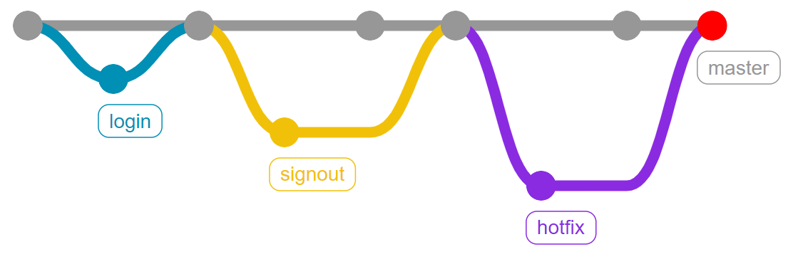

# 3일차 정리

## git 버전관리

- git branch
  - branch : 한 프로젝트를 여러 갈래로 나누어 독립적으로 작업하게 도와주는 git의 도구
  - git branch : 브랜치 목록 확인
  - git branch -r : 원격 저장소(git)의 브랜치 목록 확인
  - git branch <브랜치 이름> : 새로운 브랜치 생성
  - git branch -d <브랜치 이름> : 병합이 완료된 브랜치 삭제
  - git branch -D <브랜치 이름> : 브랜치 강제 삭제

- git switch
  - 현재 브랜치에서 다른 브랜치로 HEAD(포인터)를 이동시키는 명령어
  - git switch <옮길 브랜치 이름>
  - git swtich -c <브랜치 이름> : 브랜치 생성과 동시에 옮기기

- git merge
  - 분기된 브랜치들을 하나로 합치는 명령어
  - git merge <합칠 브랜치 이름>
  - 메인 브랜치로 switch하고 명령어 실행

- merge conflict

  

## git workflow(협업)

1. 원격 저장소의 소유권이 있는 경우(자신의 소유권 or collaborator)
   - master에 직접 개발하지 않고, `기능별로 브랜치`를 따로 만들어 개발
   - `pull request` 를 같이 사용하여 변경 내용에 대한 소통 진행
   - 작업 흐름
     	1. 소유권이 있는 원격 저장소를 로컬 저장소로 clone 
     	1. 사용자는 자신이 작업할 기능에 대한 `브랜치를 생성` 하고 , 그안에서 `기능 구현`
     	1. 기능 구현이 완료되면 원격 저장소에 해당 브랜치를 `push`
     	1. 원격 저장소(github)에는 각 기능에 대한 브랜치가 반영됨
     	1. pull request를 통해 브랜치를 master에 반영
     	1. 병합이 완료되면 원격 저장소에 있는 병합이 완료된 브랜치는 삭제
     	1. 병합으로 인해 변경된 master 브랜치를 pull을 통해 받아오기
     	1. master를 받았으므로 각 로컬의 브랜치는 삭제
     	1. 새로운 작업 시 다시 반복

2. 원격 저장소 소유권이 없는 경우(fork & pull)

- 오픈 소스 프로젝트와 같이 자신의 소유가 아닌 원격 저장소일 경우 사용
- 원본 원격 저장소를 내 원격 저장소에 `복제`(fork)
- 기능 완성 후 `push는 내 원격 저장소`에 진행
- 이후 `pull request`를 통해 원본 원격 저장소에 반영될 수 있도록 요청
- 순서
  1. fork
  2. clone
  3. 브랜치 생성
  4. 작성
  5. add
  6. commit
  7. 브랜치 push
  8. pull & request